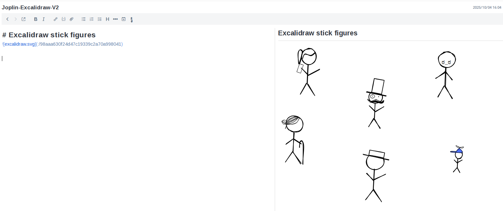

# Joplin-excalidraw v2

[Excalidraw](https://github.com/excalidraw/excalidraw) support in Joplin for Desktop. 

## How to?

Click the Excalidraw button on the toolbar to generate a new diagram:

```

```

Click the edit button on the preview pane to edit an existing diagram.

Two separate resources will be saved for each diagram:
* the JSON definition
* the SVG for visualization in the preview pane

## Example



## Development

See [GENERATOR_DOC.md](./GENERATOR_DOC.md) for the code generation instructions.

Quick steps:
* use `yarn install --mode=update-peer-deps` to download locally the necessary dependencies
* use `npm run dist` to create a release package (it will be found under `publish/` directory)

In Joplin you can use the `dist/` directory directly by setting it under `Tools` -> `Options` -> `Plugins` -> `Show advanced settings`.

## Notes & credits

> [!CAUTION]
> Not compatible with the Freehand Drawing plugin, it causes glitches when both are enabled.

- This is a fork of https://github.com/artikell/joplin-excalidraw; notes created with that version are currently supported
- The [excalidraw](https://github.com/excalidraw/excalidraw) library is bundled into the plugin, together with fonts and assets.
- Tested on MacOS, Linux and Windows Desktop apps
- This project refers to the [ThibaultJanBeyer/joplin-sheets](https://github.com/ThibaultJanBeyer/joplin-sheets) project, thank you
- Thanks to [@Winbee](https://github.com/Winbee) to refactor by vite
- Thanks to [@smallzh](https://github.com/smallzh) for the SVG preview support
